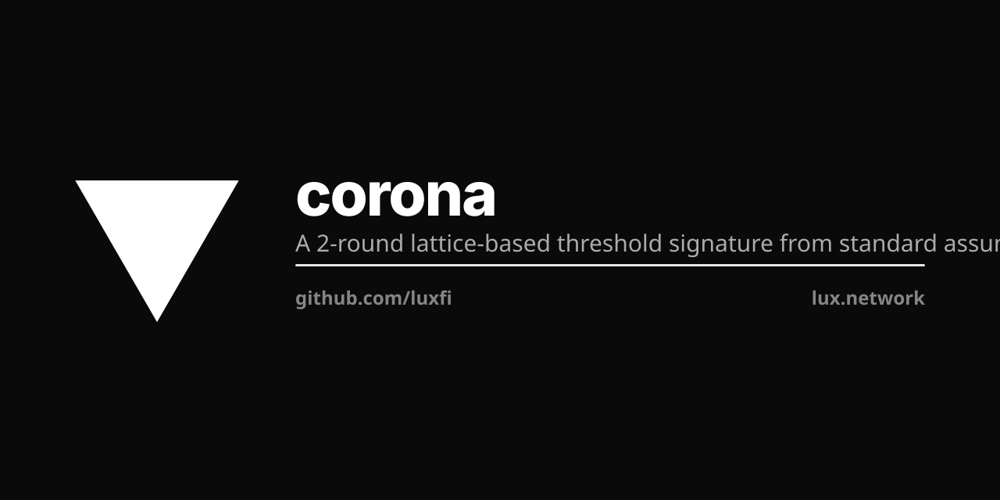

<p align="center"></p>

# Corona

> Lux is not merely adding post-quantum signatures to a chain; it defines a hybrid finality architecture for DAG-native consensus, with protocol-agnostic threshold lifecycle, post-quantum threshold sealing, and cross-chain propagation of Horizon finality.

See [LP-105 §Claims and evidence](https://github.com/luxfi/lps/blob/main/LP-105-lux-stack-lexicon.md#claims-and-evidence) for the canonical claims/evidence table and the ten architectural commitments — single source of truth.

**Corona** is the Lux **Module-LWE** post-quantum threshold signature library
for **Quasar consensus**. The 2-round threshold construction line traces back
to the Boschini–Kaviani–Lai–Malavolta–Takahashi–Tibouchi Module-LWE paper
([ePrint 2024/1113](https://eprint.iacr.org/2024/1113)). Corona adds the
production lifecycle that line lacked: Pedersen DKG over `R_q` with proper
hiding, proactive resharing for epoch validator rotation, identifiable
abort, and the integration surface Quasar consumes.

The **ML-DSA sibling library** lives at [`luxfi/pulsar`](https://github.com/luxfi/pulsar).
Pulsar is also Module-LWE, but a different construction: its threshold
signature output is byte-equal to FIPS 204 single-party ML-DSA (NIST MPTC
Class N1). The two libraries are independent — there is no import line
between them — and Quasar consumes them as parallel kernels selected
per-chain via `FinalitySchemeID`.

## Why "Corona"

A corona is the luminous ring of light surrounding a star — visible only
when the brighter central body (the Pulsar / Quasar) is partially occluded.
Brand-paired with Pulsar (Module-LWE) and Quasar (the consensus that
consumes both): the same family of threshold-finality light, observed at
a different layer.

## Production lifecycle additions

The original Boschini et al construction (ePrint 2024/1113) is a
research artefact — trusted-dealer DKG, no proactive resharing, no
integration surface. Corona is the production track that fills those
gaps:

| Layer | Original Module-LWE construction | Corona |
|---|---|---|
| 2-round threshold sign | ✅ same byte-equal protocol | ✅ inherited |
| Trusted-dealer Gen | ✅ for fixed federation | ✅ tests / KAT / CLI / permissioned bridge MPC only — never the chain keygen path |
| **Proactive resharing** for epoch validator rotation | ❌ not specified | ✅ **corona/reshare/** (this fork) |
| **Pedersen DKG over R_q** with proper hiding | ❌ not specified | ✅ **corona/dkg2/** — production keygen default since v0.7.5 |
| Per-validator triple-sign integration with Quasar | ❌ N/A | ✅ consumed by **luxfi/consensus/protocol/quasar** |

## Composition with Pulsar as optional layered PQ defense

Corona is independently usable: a chain can pick Corona as its
sole PQ threshold layer, no cross-dependency on Pulsar. Lux primary-
network QuasarCert combines both Module-LWE schemes as a **Double Lattice**
layered defence: Pulsar and Corona are distinct schemes at different
parameter regimes (Pulsar = FIPS-204 ML-DSA; Corona = the Ringtail/Raccoon
threshold, parameters tuned for threshold signing), so an adversary must
break **both** independently — a construction-, parameter-, or
implementation-specific flaw in one does not break finality (both have to be
cracked). This is construction/parameter/implementation diversity, not
hardness-assumption diversity — both rest on Module-LWE, so a break of
Module-LWE itself would affect both legs; assumption-disjoint diversity
comes from the hash-based Magnetar (SLH-DSA) leg:

```
QuasarCert {
    BLS         — optional classical fast-path (BLS-12-381 aggregate)
    Corona      — Module-LWE threshold (Raccoon/Ringtail line; this repo)
    Pulsar      — Module-LWE threshold ML-DSA (luxfi/pulsar)
    MLDSARollup — per-validator ML-DSA-65 rolled up via STARK/FRI (P3Q)
}
```

Each layer is checkable independently with no shared code; selecting
the layer happens at chain-construction time via the `FinalitySchemeID`
axis on the chain's `ChainSecurityProfile`. The pure-PQ profile drops
BLS entirely and runs on `Corona + Pulsar`.

In that pure-PQ `Corona + Pulsar` AND-mode cert the two lattice legs are
not interchangeable in trust model. Because Corona's keygen is natively
dealerless (the production-default Pedersen DKG), **Corona is the leg that
carries the permissionless / no-trusted-dealer guarantee** — the property
Pulsar's byte-FIPS-204 keygen cannot provide, since a dealerless sum of
FIPS-204 secrets would break ML-DSA's small-norm (`S_η`) bound, leaving
Pulsar's key generation provably stuck at a trusted dealer.

## Layout

- `sign/` — 2-round threshold signing (byte-equal with upstream)
- `primitives/` — Shamir, hashes, MACs, PRFs (byte-equal with upstream)
- `utils/` — NTT, Montgomery, ring helpers (byte-equal with upstream)
- `networking/` — TCP peer-to-peer (byte-equal with upstream)
- `dkg/` — original Lux DKG (Feldman VSS without noise; **broken** for public broadcast — see RED-DKG-REVIEW). Retained for reference.
- `dkg2/` — proper Pedersen DKG over R_q (Pulsar addition; this fork)
- `reshare/` — proactive secret resharing for epoch rotation (Pulsar addition; this fork)
- `cmd/` — KAT oracle generators

## Status

Production. The 2-round Sign+Verify path is byte-equal-validated against
the original Module-LWE construction (ePrint 2024/1113) via 16 SHA-256 KATs.
The dealerless **Pedersen DKG** (`dkg2/`, entered through
`keyera.Bootstrap` / `BootstrapPedersen`) is the **production keygen
default since v0.7.5**: it opens a new key era without a trusted dealer,
so no single party ever holds the secret. Signing never reconstructs the
key — `SignFinalize` sums the per-party partial responses
(`z_sum = Σ z_j`, then `A·z_sum`), so the master secret is never formed.
Proactive resharing (`reshare/`) for epoch validator rotation ships
alongside it; the trusted-dealer keygen helpers remain only as
tests / KAT / CLI footguns (and permissioned bridge MPC), never the
chain keygen path.

Corona remains the Ringtail/Raccoon-derived Module-LWE leg (Boschini et al.,
ePrint 2024/1113) with its own parameter set: it is **not** FIPS-204
byte-equal, and its certificates are variable-size Module-LWE certificates,
larger than Pulsar's FIPS-204-equal output.
